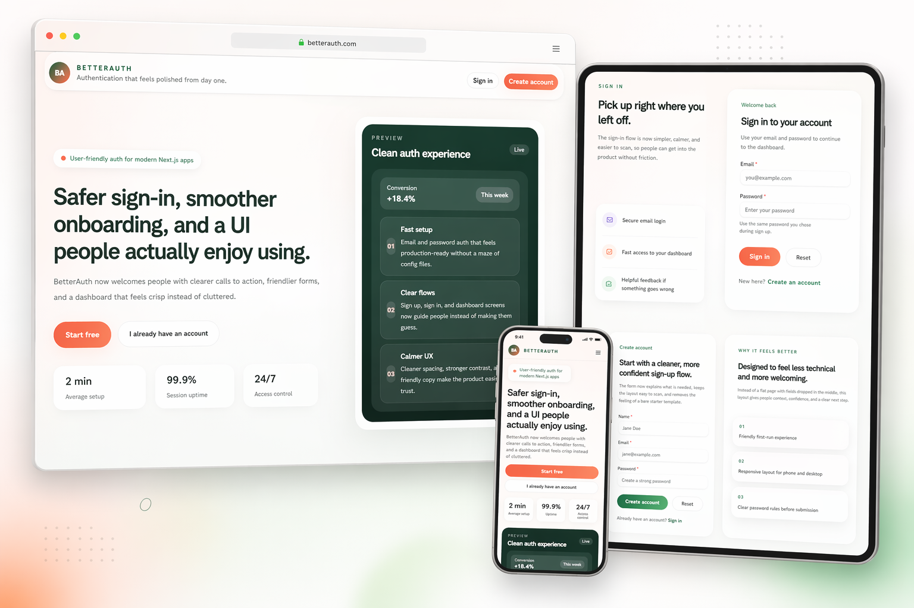
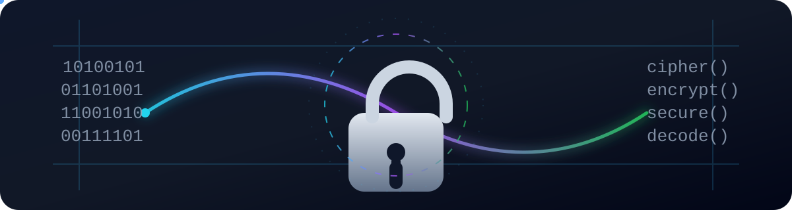

# betterAuth

A modern authentication app built with **Next.js** and **Better Auth**, styled with **HeroUI** and **Tailwind CSS**.

## Mockup



## Animated encryption preview



This animation adds a security-themed visual layer to the project and reinforces the authentication/encryption vibe.

## Tech stack

This project uses:

- **Next.js 16** — App Router and React framework
- **React 19** — UI library
- **Better Auth** — authentication system
- **@better-auth/mongo-adapter** — MongoDB adapter for Better Auth
- **MongoDB** — database
- **HeroUI** (`@heroui/react`, `@heroui/styles`) — UI components and styling
- **Tailwind CSS 4** — utility-first styling
- **PostCSS** — CSS processing
- **react-spinners** — loading indicators
- **@gravity-ui/icons** — icon set
- **ESLint** — code linting
- **Babel React Compiler** — React compile-time optimization

## Getting started

Install dependencies:

```bash
npm install
```

Run the development server:

```bash
npm run dev
```

Open [http://localhost:3000](http://localhost:3000) in your browser.

## Available scripts

```bash
npm run dev
npm run build
npm run start
npm run lint
```

## Project structure

```bash
src/
├─ app/
│  ├─ api/auth/
│  ├─ auth/
│  ├─ dashboard/
│  └─ page.js
├─ assets/
│  └─ mockup.png
└─ lib/
   ├─ auth.js
   └─ auth-client.js
```

## Notes

- The app is built with the Next.js App Router.
- Authentication is handled with Better Auth.
- The mockup image is stored in `src/assets/mockup.png`.
- The animated encryption graphic is stored in `public/encryption-animation.svg`.
